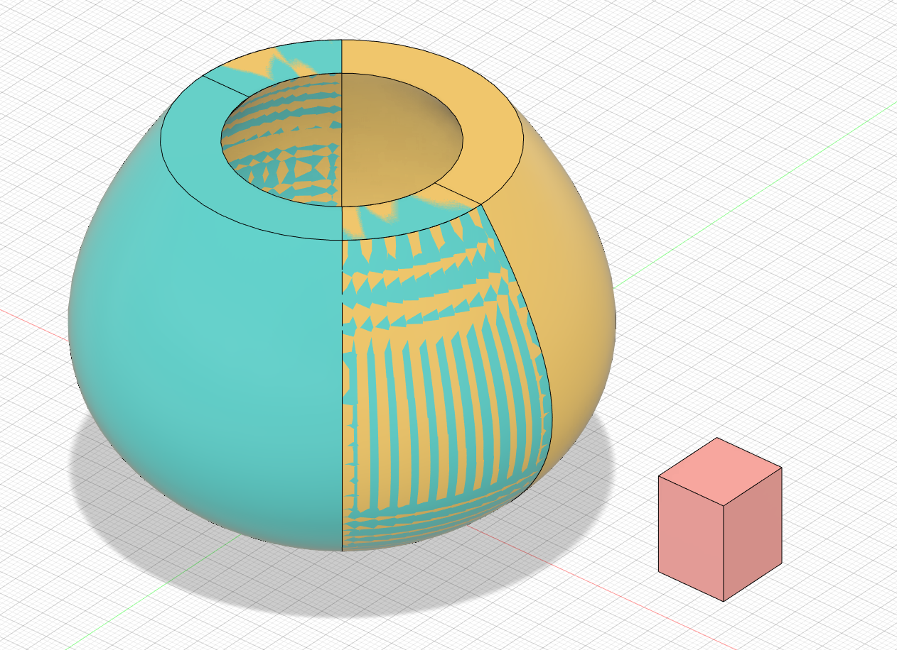

# Finger Joints

This add-in for Autodesk Fusion 360 can create a finger joint (box joint) from the overlap of two objects. Although, not specifically designed for this, the add-in also works for lap joints and can cut pieces into slices.

## Installation

Download the [latest version of the plugin](https://github.com/FlorianPommerening/FingerJoints/archive/master.zip), unpack it to your add-ins directory (see below) and remove the "-master" from the name. To start the add-in inside Fusion use the "ADD-INS" button in the "TOOLS" ribbon, then find the add-in in the "Add-Ins" tab, select it and click "Run".

Add-ins directory

* Windows:  `%AppData%\Autodesk\Autodesk Fusion 360\API\AddIns`
* Mac OS X:  `~/Library/Application Support/Autodesk/Autodesk Fusion 360/API/AddIns`  
  or ` ~/Library/Containers/com.autodesk.mas.fusion360/Data/Library/Application Support/Autodesk/Autodesk Fusion 360/API/AddIns`

There are also [more detailed installation instructions](https://tapnair.github.io/installation.html) by Patrick Rainsberry.

## Usage

Select two overlapping bodies and a direction. The direction is required, so the add-in knows in which plane to cut. In most cases, you probably want an edge that runs along the joint as shown in the picture.

The next setting controls whether the first body has fingers on both ends, notches on both ends, or a finger on one end and a notch on the other. In the next picture, we place three fingers on the first body with different settings, the number of fingers on the second body adjusts accordingly.

The next settings determine how the size of the overlap is distributed between fingers of the first body and fingers of the second body (as we view everything from the perspective of the first body, we call fingers of the second body "notches").

When the number of fingers is fixed, we can specify their size in three ways. In the example above, we chose to have fingers and notches of equal size. Instead, we can chose to fix the size of either fingers or notches (the other size is determined automatically). The next picture shows the effect of fixing the size of fingers or notches to 5mm.

Finally, instead of fixing the number of fingers, we might want to have both fingers and notches of a certain size and place as many fingers as will fit along the joint. Fixing both sizes could lead to cases where one body ends in half a finger, so instead, we only fix either the size of fingers or notches and specify a minimal size for the other. For example, the following picture fixes the size of a finger to 9mm and uses a minimal notch size of 5mm. The height of the joint is 50mm, so using four 9mm fingers and three 5mm notches would exceed the size by 1 mm. Instead, the add-in uses three 9mm fingers and increases the size of the two notches to 11.5mm. Likewise, we could fix the size of notches and make the size of fingers dynamic, or we could require that fingers and notches have the same size.

Of course, the objects you join do not have to be rectangular and can overlap in multiple places.

## Other Uses

In addition to creating finger joints, the add-in can be used to create lap joints and cut pieces into slices.

### Lap Joints

To create a lap joint, start with two overlapping pieces and create a finger joint with one finger placed asymmertically on the start or end of the first body.

### Slicing

This is not really by design but you can duplicate a body so it perfectly overlaps with itself, then create a finger joint between the
copy and the original. This will slice the body along your chosen axis.

## Issues

If you find any issues with the add-in, please report them on [Github][issuetracker]

## TODO / Help wanted

If you have ideas how to improve the add-in, you can create an issue on [Github][issuetracker]. Since I am working on this in my free time I cannot promise I will get to it, though. Pull requests for fixes and new features are very welcome.

The add-in is currently not parametric, so updating the underlying geometry will not update the placement or size of the fingers. I'm not sure this is possible with the current API (there is a [related request on the Fusion 360 IdeaStation][ideastation]). If you have an idea of how to implement this, please get in touch.

I am not an artist, so the icons are still [Programmer art](https://en.wikipedia.org/wiki/Programmer_art). I'd be happy to replace them with something closer to the style of the built-in commands. 

## License

[![Creative Commons License][by-nc-sa-logo]][by-nc-sa-link]

This add-in is licensed under a [Creative Commons Attribution-NonCommercial-ShareAlike 4.0 International License][by-nc-sa-link]. If you are interested in using the add-in under different terms, contact florian.pommerening@unibas.ch.

[by-nc-sa-logo]: https://i.creativecommons.org/l/by-nc-sa/4.0/88x31.png
[by-nc-sa-link]: http://creativecommons.org/licenses/by-nc-sa/4.0/
[issuetracker]: https://github.com/FlorianPommerening/FingerJoints/issues
[ideastation]: https://forums.autodesk.com/t5/fusion-360-ideastation/allow-add-ins-to-be-fully-parametric-and-represented-in-the/idi-p/8660436